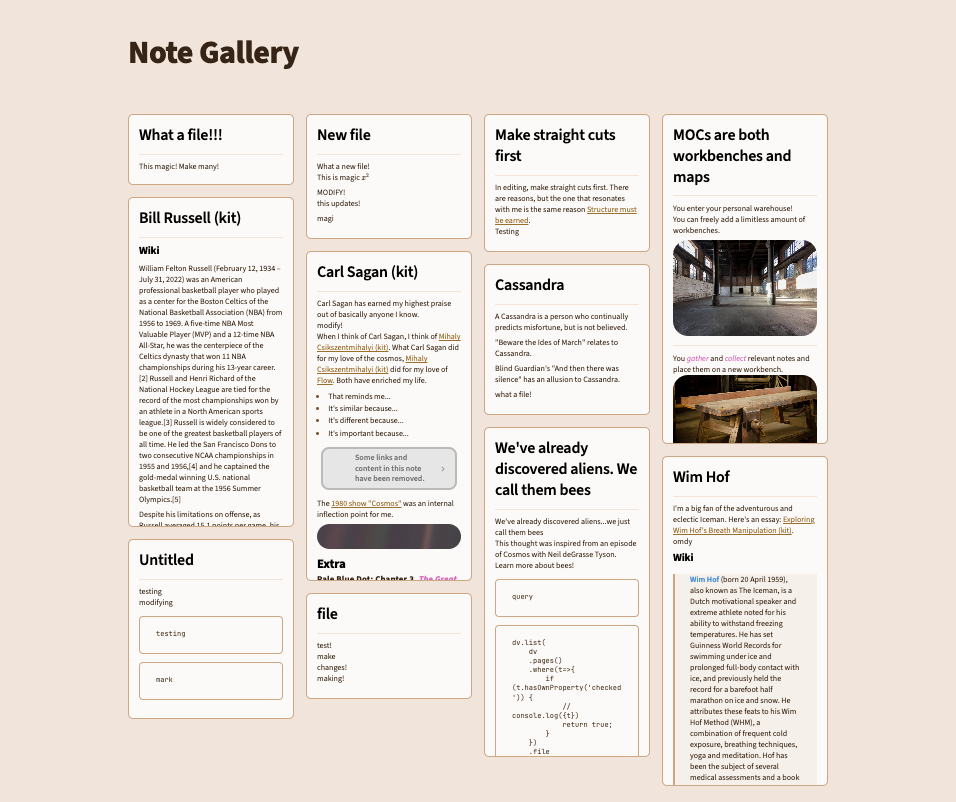

# What is it?
Note Gallery is a masonry style note gallery for [Obsidian](https://obsidian.md/).

- This plugin is currently in early alpha testing. It's functional but may contain some bugs.
- Please feel free to leave any bugs or feature requests in issues.

[](https://github.com/sponsors/pashashocky)
[](https://www.buymeacoffee.com/pashashocky)

# Functionality
## Current
- Displays notes or images using a masonry gallery by defining a code block in your note. Similar to "Safari overview mode" or "Craft-like folder view".
  - [x] Opimized the loading of markdown cards through caching.
  - [x] CRUD operations update the gallery.
- Has options for sorting, limiting # of results and recursively scanning folders.

## Work in Progress
- Actively working through issues.
- Interactive view when clicking on folders in the file switcher.
- Showing currently open tabs as a Masonry gallery.

# Installation Instructions
## BRAT
1. Install BRAT from the Community Plugins in Obsidian
  1.1 Enable the BRAT plugin in the settings
2. Open the command palette (CMD/CTRL + P) and run the command BRAT: `Add a beta plugin for testing`
3. Enter the following URL: `https://github.com/pashashocky/obsidian-note-gallery`
4. Enable the `Note Gallery` plugin in the `Community Plugins` tab in settings
5. Create a code block similar to the below in any of your notes

```
~~~~note-gallery     #           default | options
path: Atlas          # optional: current note folder | path/to/folder
limit: 10            # optional: 0 | any number
recursive: true      # optional: true | false
sort: desc           # optional: desc | asc
sortBy: mtime        # optional: mtime | ctime | name
fontSize: 6pt        # optional: 6pt | NUMBERpt | NUMBERpx
showTitle: true      # optional: true | false
~~~~
```

